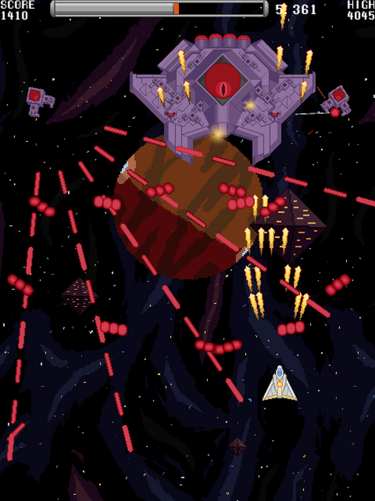

## Portfolio

---

### Game Development Related

##### [Star Gun](https://mvest.itch.io/msu-2d-shooter) (2023)

A vertical slice of a top-scrolling arcade style danmaku game I made in Unity for an online course offered by MSU.  

It consists of a single level that is a few minutes long and includes a midboss and multi-stage endboss.  The enemy patterns are entirely fixed, choreographed using editor tools I wrote for Unity's Timeline module. Because of the early decision to limit the scope to a single level, I was able to spend a good deal of time adding variety and polishing countless micro interactions in it.

This was a solo project.  I was given some base code and assets, but it was insufficient for what I wanted to do.  I ended up effectively throwing out the provided code entirely, so all of the game logic and editor tool code is original.  The sprites and sound effects are a mix of the basic assets I was given and assets that I made to match the style. The bullet, enemy variations, particle effects, and boss sprites & sfx are my own work.

The biggest lesson this project really drove home was the importance of limiting scope.  Unlike other projects I've worked on, I went into this with the intent to make a vertical slice rather than a full game.  And the benefits of it really show in the end result.  It's the first project I've worked on that felt like designing a *game* rather than an engine.  A properly complete experience.  Most of the development time was spent on level design, asset creation, and polish rather than implementing underlying game systems and framework.

---
##### [Unnamed 2D Platformer](https://github.com/mvestrand/msu-2dplatformer) (2023)
A basic partially complete 2d platformer that done for an online MSU game design course.  It was ultimately abandoned along with the rest of the course after becoming disillusioned with the courses' lack of feedback or engagement.

The given project code and assets provided were for a Unity project but I rebuilt the whole thing in Godot (partially because of some controversy going on at the time, but mostly just to satisfy my own curiosity). 

---
##### [Personal unity tools library](https://github.com/mvestrand/unity-tools) (2023)
Various bits of Unity c# code that I refactored into a simple library for reuse. It has code for object pooling, type serialization, and global variables (that is, ScriptableObjects that store variables as data assets that can be injected into fields in the editor).

---
[Basic Pacman Clone]()

---

---
[]

---
[Physics Engine](/pdf/sample_presentation.pdf) 

---
[Cube Wars](https://github.com/mvestrand/cube-wars) (20)
This was a *very* minimal game I made when first learning OpenGL.  More than the fact that it has awkward 2 player controls and no audio, the biggest problem with this is the lack of effort devoted to planning, iteration, or testing of the actual *gameplay* part of it.  At the time, I was still more preoccupied with learning the basics of what I could do, as may be apparent from the lack of creativity in the title and any real map data.  

Unfortunately, it doesn't seem to be in a playable state on other machines without doing significant work to resolve its dependency issues.

---

### Data Science Related

---
[MovieLens](https://github.com/mvestrand/MovieLens) (2020)
A project analyzing the MovieLens database and using a matrix factorization model to recommend films.  It was for a HarvardX data science course, and is written in R.

---
[Tennis](https://github.com/mvestrand/Tennis) (2020)
Capstone project for a HarvardX data science course, doing analysis on Tennis match data and attempting to predict match outcomes.

---

Page template forked from <a href="https://github.com/evanca/quick-portfolio">evanca</a>

<!-- Remove above link if you don't want to attibute -->
