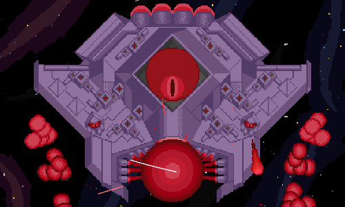

# Portfolio
## Game Development Related

### [Star Gun](portfolio/stargun) (2023)

A vertical slice of a top-scrolling arcade style danmaku game I made in Unity.  This was a solo project made for an online game design course offered by <a href="https://gamedev.msu.edu/">MSU</a>.  Making it involved creating pixel art animations, sound effects, and level sequencing tools to supplement the basic assets provided.  However for me the biggest takeaway from it was the importance of controlling scope.  I set out from the start to make this as a vertical slice, and it shows in the level of polish on the final product.

Release build:&emsp;*<a href="https://mvest.itch.io/msu-2d-shooter"> mvest.itch.io/msu-2d-shooter</a>* 
Source code:&emsp;*<a href="https://github.com/mvestrand/MSU-2DShooter">github.com/mvestrand/MSU-2DShooter</a>*

### [2D Platformer Early Prototype](portfolio/2dplatformer) (2023)

A partially complete 2d platformer made in Godot for the same online course as Star Gun.  It was a solo project made for the same online course as Star Gun.

Source code:&emsp;*<a href="https://github.com/mvestrand/msu-2dplatformer">github.com/mvestrand/msu-2dplatformer</a>*  

### [Personal unity tools library]() (2023)
A Unity package containing various bits of Unity c# code.  There's code for object pooling, type serialization, and scriptable variables (i.e. ScriptableObject data asset-based, injectable global variables).  Initially built directly into the code of other projects, I split them off into a Unity package to be able to easily add and reuse them across projects.

Source code:&emsp;*<a href="https://github.com/mvestrand/unity-tools">https://github.com/mvestrand/unity-tools</a>*  

### [Basic Pacman Clone](portfolio/pacman_clone) (2021)

A basic recreation of pacman in Unity. 

### [Application and Physics Engine Code](portfolio/application) (2015-2018)

### [Cube Wars](portfolio/cube-wars) (2014)

This was a *very* minimal game I made when first learning OpenGL.  
 

## Data Science Related

#### [MovieLens](https://github.com/mvestrand/MovieLens) (2020)
A project analyzing the MovieLens database and using a matrix factorization model to recommend films.  It was for a HarvardX data science course, and is written in R.

#### [Tennis](https://github.com/mvestrand/Tennis) (2020)
Capstone project for a HarvardX data science course, doing analysis on Tennis match data and attempting to predict match outcomes.

Page template forked from <a href="https://github.com/evanca/quick-portfolio">evanca</a>

<!-- Remove above link if you don't want to attibute -->
