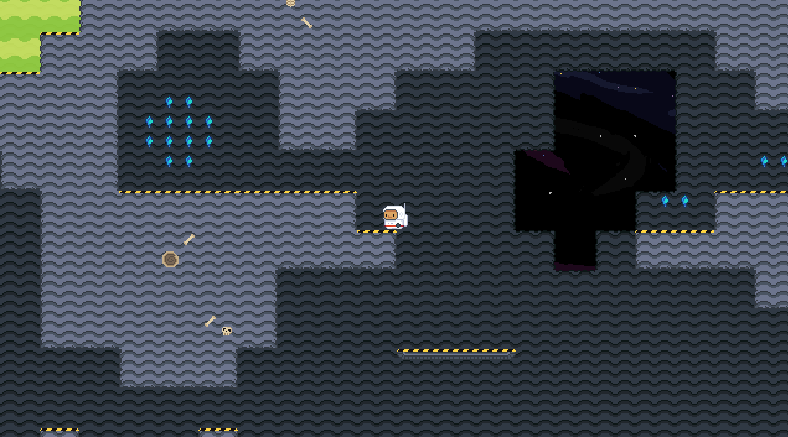
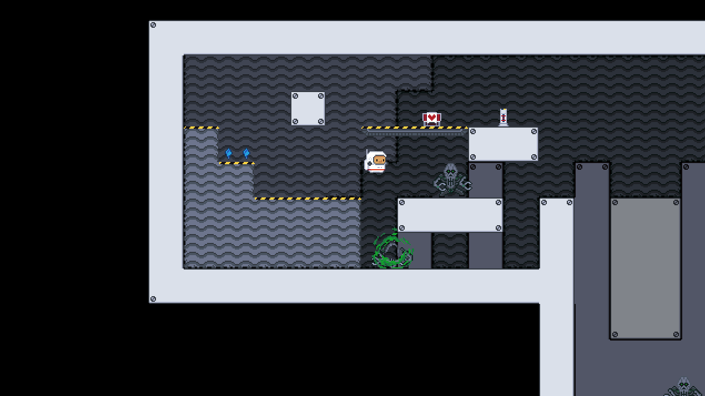
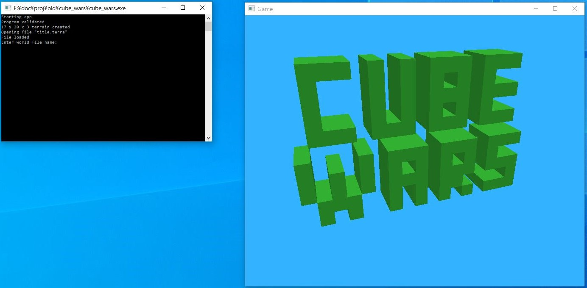
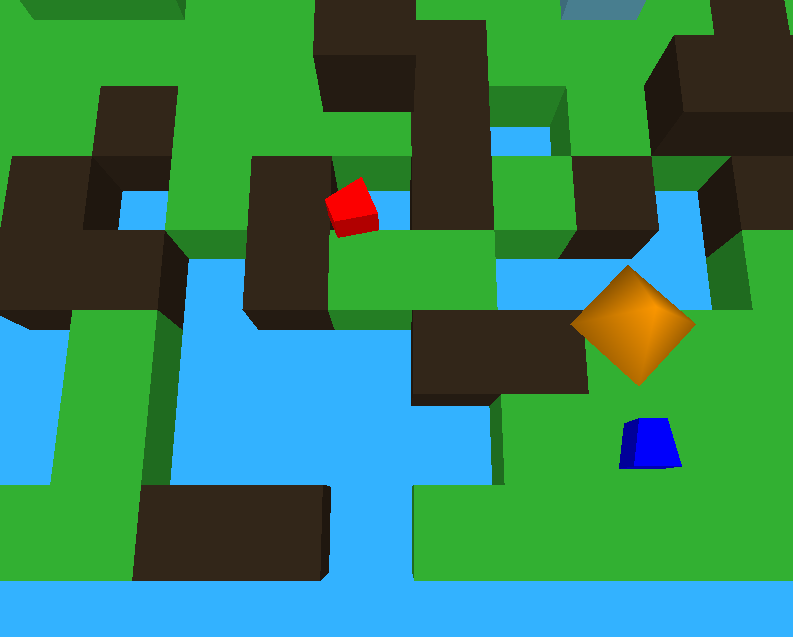

# Portfolio

## Game Development Related

#### [Star Gun](https://mvest.itch.io/msu-2d-shooter) (2023)
A vertical slice of a top-scrolling arcade style danmaku game I made in Unity for an online course offered by MSU
<figure style="max-width: 480px; margin: 20px;" >

<figcaption style="font-size:11px; text-align:center;">The boss segment at the end of the level.  The player doesn't have room to look at the top of the screen, so the background's movement acts as a secondary visual indicator of time remaining.</figcaption>
</figure>

The finished game consists of a single level a few minutes long including a midboss and multi-phase end of level boss.  The enemy patterns are entirely controlled using Unity's Timeline module and spline code I wrote for it.  The choreography was also done with custom-made editor tools integrated into the timeline editor.

This was developed as a solo project.  The early decision to limit the scope to a single level meant that I was able to spend a good deal of time adding variety and polishing micro-interactions in it.  I designed the pacing of the level around the background music.  I was given some base code and assets, but it was insufficient for what I wanted to do and I ended up effectively throwing out the provided code, so all of the game logic and editor tool code is original. The sprites and sound effects are a mix of the basic assets I was given and assets that I made to match the style. The enemy variations, particle effects, and boss sprites & sfx are my own work.

［PICTURE HERE of development tools］

There is a good amount of variety in it for a single level, and I'm happy with the current feel of the gameplay. It's a bit mechanically simple, without any unique gimmicks to make it stand out, but I feel it's well done for what it is.

Looking back, the biggest issue with it is that it's overtuned.  Pacing-wise, I would say it's too aggressive, both in the rate at which it introduces new enemy behavior and the rate that it ramps up in difficulty.  The high difficulty was for the most part intentional, as it was intended to evoke old arcade shmups which can be notoriously difficult (e.g. dodonpachi, ikaruga, mushihimesama).  It's also something of a necessary compromise I had to make to be able to fit anything interesting into the short overall length of it.  Still, it's a bit much.  

A potential solution for the difficulty would be to add mechanics like bombs or shields that give the player more breathing room.  If it were to be made into a full game, I would also pace out and expand more on the ideas in it. For instance, a lot more could be done with the asteroid section, probably enough to be made into a full level. It would benefit from some more lulls in the action for contrast. Slower, calmer sections (maybe against static emplacements or something) where the player is more focused on score and clearing enemies rather than not dying. 

It has various other minor issues and missing bits of polish which I've listed below as "quibbles."  Small things like having no engine effects on the player ship and no visible lives counter.  Overall though, I'm happy with the current state of it and the many small issues like these that I was able to polish away.

The biggest lesson this project really drove home was the importance of limiting scope.  Unlike other projects I've worked on, I went into this with the intent to make a vertical slice rather than a full game.  And the benefits of it really show in the end result.  It's the first project I've worked on that felt like designing a *game* rather than an engine.  A properly complete experience.  Most of the development time was spent on level design, asset creation, and polish rather than implementing underlying game systems and framework.

Release build:&emsp;*<a href="https://mvest.itch.io/msu-2d-shooter"> mvest.itch.io/msu-2d-shooter</a>* 
Source code:&emsp;*<a href="https://github.com/mvestrand/MSU-2DShooter">github.com/mvestrand/MSU-2DShooter</a>*

*Note: If the movement feels off in the browser based game (eating input, no diagonal movement, etc.), try using one of the downloadable versions instead.  There's a weird issue in some browsers which seems to limit the number of simultaneous held keys, causing frustrating issues. As far as I can tell, there is no way to resolve it other than digging into Unity's input system code.*

<h6 style="margin-top:.5em; margin-bottom:.5em;">Quibbles</h6>
<ul class="side-notes">
<li>The mines need a visible radius to indicate where is safe and convey that they are proximity activated (also potentially add a short, visible activation delay).</li>
<li>The player ship's feel would be better with an engine effect and a faint visible trail (both to convey movement and as a player fiddle). We were given an animation loop for it, but I'm unhappy with how visually noisy it is in an inherently noisy genre. It needs to be a more subtle effect, otherwise it's better without it.</li>
<li>Add visual roll to the player ship when pressing left or right. Not to effect gameplay at all, just to be an aesthetic touch and a potential player fiddle (maybe by spamming the left and right keys back and forth to build up spin).</li>
<li>Add a reason *not* to constantly hold down shoot, probably by having something that's more dangerous when destroyed. Some games do this by making holding the fire button (instead of slowly tapping it) act as the slow movement button</li>
<li>I *could* add back in the focusing of the firing pattern that happens with the shift key. Adding a brief interpolation between the two makes tapping focus work as another player fiddle. However, I think I prefer the current spread out pattern because it incentivizes the player to get closer to the enemy for more damage, adding a risk-reward aspect to it. *Some* kind of change could happen though, maybe only being partially more focused, or having small focused vs homing. At the very least, there should be some visual change when using it.</li>
<li>Adding some forms of collectibles for extra-points along with a way to suck up everything on screen at once, probably by crossing a line at the top of the screen. It needs to care in the visual design of them to keep them from being visually distracting.</li>
<li>It's common to have some form of attack power-up. However, I feel it's hard enough as is without adding an extra punishment for dying. If I did add it, it would probably be as 1-4 little drones around the player (fixed formation with a slight eased delay while following the player's movement to make them feel a bit bouncy). Actually, they could probably also act simultaneously as an extra-hit as well as a boost to damage, so maybe it could make the game a bit easier.</li>
<li>It needs some way to know the number of lives remaining. Maybe at the top of the screen with a solid background along with bombs and weapon strength, or as a visual on the ship itself (maybe shields that break, maybe the ship becomes visibly damaged, maybe you have a little series of orbs that follow). I initially added simplistic icons of the ship to the hud, but removed it to reduce visual noise.</li>
<li>If possible, it would be good to fix the known issues of the in-browser version: the broken held inputs issue *(no idea how to resolve it)*, and the missing low-pass fade-in on the bgm *(just add a bgm version with the effect baked in).*</li>

</ul>

#### [Unnamed 2D Platformer](https://github.com/mvestrand/msu-2dplatformer) (2023)
##### What it is
A basic partially complete 2d platformer made for an online MSU game design course

It was ultimately abandoned along with the rest of the course after becoming disillusioned with the online course's lack of feedback and engagement. The code and assets provided by the course were for a Unity project, but I rebuilt them in Godot as an exercise. I was still in the middle of working out mechanics, movement, and camera behavior, so there is only one level and some simple obstacles made for testing.  

##### Development
The biggest problem I was working on is the lack of engaging core mechanics to design gameplay around.  There are some assets like enemies, moving platforms, and health pickups that were made but not yet used or tested in any actual gameplay.  But fundamentally, the game needs more elements that interact with the player and give them meaningful agency.  Ideally, new elements should add new challenges involving timing, sequencing, and exploration.  New tiles like crumbling platforms, new interactables like switches, and new reactive enemy behavior are some examples of such elements that could be used in all of these ways.  Adding new player movements such as: wall kicks, a dash, climbing and ledge grabbing could also help.  Provided it were accompanied by connected elements designed around them.  

I was also still debating how to structure the game experience overall. It currently just has a simple course clear structure, but there were a few directions I was considering focusing on. 

One aspect I had planned to eventually focus on was environmental storytelling and obstacles to give the game a simple narrative.  Personally, I find having a narrative in mind helps me come up with gameplay elements, and for this project I had a narrative around a "space engineer."  They need to stop the moonbase facility's AI gone rogue and its army of robots to save the day.  It's not the most original or nuanced narrative, but it's plenty to help get some ideas for a simple game.

One idea was to give the player a "magneto-wrench" that they would use as their primary tool for interacting with the world. They would use it as a sort of grapple hook for movement, a weapon to throw and whack enemies with, and as a way to interact with level elements like switches and vents. 

<figure style="margin: 20px;" >

<figcaption style="font-size:11px; text-align:center;">Basic enemies, health pickups, and moving platforms were implemented, but had yet to actually be used in a level.</figcaption>
</figure>

##### Strengths & Weaknesses
One area that I'm mostly satisfied with is the camera movement.  The code originally provided just locked on to the player, keeping them at the center of the screen at all times.  The problem with this simple approach is that it effectively makes the level constantly moving as you navigate it, removing some sense of visible progress through the level and making tricky platforming feel bad. Particularly the up and down movement of just jumping becomes sort of nauseating.  So for even basic movement to work well, the camera behavior needed reworking. 

With some trial-and-error, I made two key changes. First, I added a deadzone to the camera and an interpolated delay, making the player drag the screen with them.  I'm not entirely happy with this solution as it makes the space in front of the player less visible, but it does at least help with the camera movement while jumping. Second, I added hard camera boundaries.  Critically, this allows for the ground to be at the bottom of the screen, giving the player room to jump without the camera bobbing.

However, a key feature that is still missing from the camera is the ability to add soft camera boundaries to break up the gameplay into rooms.  This would allow for much less camera movement and an overall better experience.  It would also provide a natural delineation to the gameplay using the camera, with each room effectively being a single challenge or mini-level containing a few puzzles or gameplay moments.  Ideally, this would both give it a more clear structure to the player, and make designing it easier.  The bite-sized nature of it would also be an advantage in the context of a vertical slice, as you can add, reorder, and remove rooms easily without worrying about completely breaking the overall game structure.

As a crucial element to the feel of a platformer, I was focused on getting it fixed first, so there are plenty of other small touches like input buffering that are still missing.

##### Lessons learned
The core take away from this project for me though, was the need for other people.  Without anyone to share ideas with or get advice and feedback from, everything is harder, slower, and not as good as it could be.  You don't get the chance to see anything outside of your own perspective and assumptions.  Equally as important, the motivation and purpose that community gives is missing.  Games are made for people to enjoy.  If they're only made for the developer themselves, then it's all too easy for them to completely lose purpose and be left unfinished.

Most recent build:&emsp;*<a href=""><s>github.com/mvestrand/msu-2dplatformer</s></a>*  
Source code:&emsp;*<a href="https://github.com/mvestrand/msu-2dplatformer">github.com/mvestrand/msu-2dplatformer</a>*  

#### [Personal unity tools library](https://github.com/mvestrand/unity-tools) (2023)
A Unity package containing various bits of Unity c# code.  There's code for object pooling, type serialization, and scriptable variables (i.e. ScriptableObject data asset-based, injectable global variables).  Initially built directly into the code of other projects, I split them off into a Unity package to be able to easily add and reuse them across projects.

Source code: *https://github.com/mvestrand/unity-tools*

#### [Basic Pacman Clone](https://github.com/mvestrand/pacman-clone) (2021)
A basic recreation of pacman in Unity. 

I ended up making this as a way to learn and practice using Unity without also trying to design a game at the same time. I had used Unity some before this, but this was the first time making editor tools for it.

There are some issues with it, such as missing sound effects and  incorrect behavior. Unfortunately, its difficult to fix because the code for it is poorly structured. It would need such a large refactor that it likely be better to completely rebuild it from the ground up.

<figure style="max-width: 480px; margin: 20px" >

<figcaption style="font-size:11px; text-align:center;">Screenshot of the custom spawning and pathing tilemap editor in unity.</figcaption>
</figure>

Release build:&emsp;*<a href="https://github.com/mvestrand/pacman-clone/releases/tag/v0.1">github.com/mvestrand/pacman-clone/releases/tag/v0.1</a>*  
Source code:&emsp;*<a href="https://github.com/mvestrand/pacman-clone">github.com/mvestrand/pacman-clone</a>*  

#### [Application and Physics Engine Code]() (2015-2018)
This is a jumble of code made over several years outside of my undergraduate coursework while I was still learning.  I hesitate to include it here, as it isn't a shining example of excellent coding or finished creative work. However I think it's important to include for the variety of knowledge and lessons learned from it.  It was written when I was still learning to organize code and use source control, making it difficult to untangle now.  There's code for doing basic rendering in openGL, loading of obj files and textures, audio using SDL.  There's basic broadphase collision detection code. There's code for a basic impulse-based physics engine written while following along with a textbook. There's the rough beginnings of an object and scene system in it. At one point it was a little asteroids game. I had intended to make a game, but it's really just became a mess of code created to try out what I was learning.

I learned about a variety of the systems and architecture underneath games, but after spending years trying to do everything on my own, I think it was the more general development lessons it drove home that matter the most.  The most important being—alongside the importance of source control, organization, and documentation—to follow the oft-repeated advice: "Don't reinvent the wheel."  Use game engines and existing libraries over making your own whenever possible.  When using a game engine, it's easy to forget just how much work goes into the design, creation, and maintenance of that underlying framework.  It's certainly helpful to understand how they work for the sake of better utilizing and when *truly* necessary modifying them, but choosing not to use existing tools always comes at the cost of having to build and maintain those new tools yourself.  A cost you almost never want to pay if you can avoid it, as those resources could be better spent on creating the game itself.

The jumble of code I am still untangling: *https://github.com/mvestrand/cpp-physics-engine*

github: *<a href="https://github.com/mvestrand/cpp-physics-engine">github.com/mvestrand/cpp-physics-engine</a>*  *There's significantly more physics code in the general repo for doing contact detection and resolution, as well as rendering for testing, but it seems it was never properly merged into this repo.*

#### [Cube Wars](https://github.com/mvestrand/cube-wars) (2014)
This was a *very* minimal game I made when first learning OpenGL.  

<figure style="max-width: 900px; margin: 20px;">

<figcaption style="font-size:11px; text-align:center;">The main menu consisted of a rotating title with all of the setup done through the console.</figcaption>
</figure>

The players control little wedges that can jump and drop bombs to destroy terrain and players. The goal was to be the last one alive for the most rounds, defeating the other players without falling or exploding.  The destroyed blocks would sometimes drop power ups to make the player move faster, have more bombs, or bigger explosions.

<figure style="max-width: 450px; margin: 20px;">

<figcaption style="font-size:11px; text-align:center;">Red & blue players with an orange explosion.  The brown tiles have a single hp left before they break.</figcaption>
</figure>

More than the fact that it has awkward two player controls and no audio, the biggest problem with this is the lack of effort devoted to planning, iteration, and testing of the actual *gameplay* part of it.  At the time, I was still more preoccupied with learning the basics of what I could do, as may be apparent from the lack of creativity in the title and the absence of any real map data.  Most things were done in code, making it slow to iterate on.

Source code:&emsp;*<a href="https://github.com/mvestrand/cube-wars">github.com/mvestrand/cube-wars</a>*  

*Unfortunately, it doesn't seem to be in a playable state on other machines without doing significant work to resolve its dependency issues.*

## Data Science Related

#### [MovieLens](https://github.com/mvestrand/MovieLens) (2020)
A project analyzing the MovieLens database and using a matrix factorization model to recommend films.  It was for a HarvardX data science course, and is written in R.

#### [Tennis](https://github.com/mvestrand/Tennis) (2020)
Capstone project for a HarvardX data science course, doing analysis on Tennis match data and attempting to predict match outcomes.

Page template forked from <a href="https://github.com/evanca/quick-portfolio">evanca</a>

<!-- Remove above link if you don't want to attibute -->
