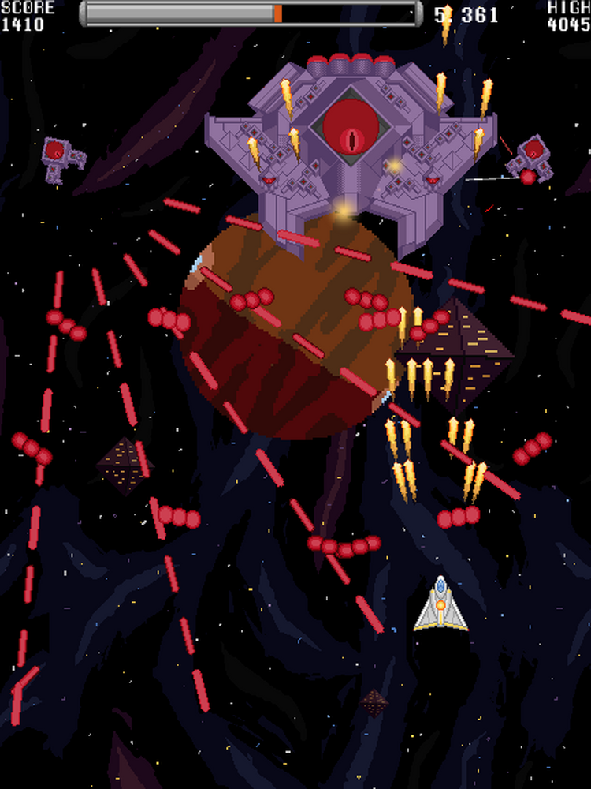
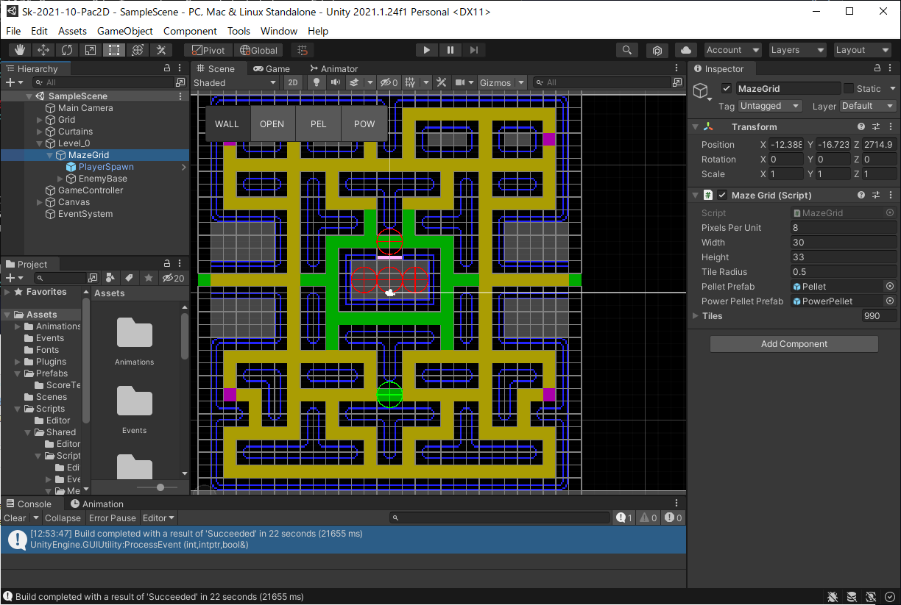

# Portfolio

## Game Development Related

#### [Star Gun](https://mvest.itch.io/msu-2d-shooter) (2023)

A vertical slice of a top-scrolling arcade style danmaku game I made in Unity for an online course offered by MSU.  
<figure style="float: right; max-width: 480px; width:40%;  margin: 20px;" >

<figcaption style="font-size:11px; text-align:center;">The boss segment at the end of the level.</figcaption>
</figure>
It consists of a single level that is a few minutes long and includes a midboss and multi-stage endboss.  The enemy patterns are entirely fixed, choreographed using editor tools I wrote for Unity's Timeline module. Because of the early decision to limit the scope to a single level, I was able to spend a good deal of time adding variety and polishing countless micro interactions in it.

This was a solo project.  I was given some base code and assets, but it was insufficient for what I wanted to do.  I ended up effectively throwing out the provided code entirely, so all of the game logic and editor tool code is original.  The sprites and sound effects are a mix of the basic assets I was given and assets that I made to match the style. The bullet, enemy variations, particle effects, and boss sprites & sfx are my own work.

The biggest lesson this project really drove home was the importance of limiting scope.  Unlike other projects I've worked on, I went into this with the intent to make a vertical slice rather than a full game.  And the benefits of it really show in the end result.  It's the first project I've worked on that felt like designing a *game* rather than an engine.  A properly complete experience.  Most of the development time was spent on level design, asset creation, and polish rather than implementing underlying game systems and framework.

It's arguably overtuned, particularly returning to it after some time.  I would argue that it's difficulty is for the most part intentional, as it was an intended to evoke old arcade shmups which can be notoriously difficult (e.g. dodonpachi, ikaruga, mushihimesama).  Its also something of a necessary compromise I had to make to be able to fit anything interesting into the short overall length of it.  Pacing-wise, I would say it's also maybe a bit too aggressive, both in the rate at which it introduces new concepts and the rate that it ramps up in difficulty. Particularly for a first level it's a bit much, so this would probably need to be a second or third-level in a full game. 

If it were to be made into a full game, I would probably also pace out and expand more on the ideas in it. For instance, a lot more could be done with the asteroid section, probably enough to be made into a full level. It also would benefit from some more lulls in the action for contrast. Slower, calmer sections (maybe against static emplacements or something) where the player is more focused on clearing enemies rather than not dying. This would have to be in a completely different level though, as the current pacing of it is largely set in stone by being designed around the background music.

*Note: If the movement feels off in the browser based game (eating input, no diagonal movement, etc.), try using one of the downloadable versions instead.  There's a weird issue in some browsers which seems to limit the number of simultaneous held keys, causing frustrating issues. There is no way to resolve it, as far as I can tell, other than digging into Unity's input system.*

itch.io: *https://mvest.itch.io/msu-2d-shooter* 
Source on github: *https://github.com/mvestrand/MSU-2DShooter*

###### Potential improvements that could be made
- The mines need a visible radius to indicate where is safe and convey that they are proximity activated (also potentially add a short, visible activation delay).
- The feel of the player ship would be better with an engine effect and a faint visible trail (both to convey movment and as a player fiddle). We were given an animation loop for it, but I'm unhappy with how visually noisy it is in an inherently noisy genre. It needs to be a more subtle, non-distracting effect, otherwise it's better the way it currently is with nothing at all.
- Adding a reason *not* to constantly hold down shoot, probably by having something that's more dangerous when destroyed. Some games do this by making holding the fire button (instead of slowly tapping it) act as the focused movement button
- Adding visual roll to the player ship when pressing left or right. Not to effect gameplay at all, just to be an aesthetic touch and a potential player fiddle (maybe by spamming the left and right keys back and forth to build up spin). The best way is probably to make a simple
- I *could* add back in the focusing of the firing pattern that happens with the shift key. Adding a brief interpolation between the two makes tapping focus work as another player fiddle. However, I think I prefer the current spread out pattern because it incentivizes the player to try to get closer to the enemy, adding a risk-reward aspect to it. *Some* kind of change could happen though, maybe only being partially more focused, or having small focused vs homing. At the very least, there should be some visual change when using it.
- Adding some forms of collectibles for extra-points. There should also be a way to suck up everything on screen at once, probably by crossing a line at the top of the screen. It needs to care in the visual design of them though to keep them from being visually distracting.
- It's common to also have some form of attack power-up and bombs. However, I feel it's hard enough as is without adding an extra punishment for dying. If I did add it, it would probably be as 1-4 little drones around the player (fixed formation with a slight eased delay while following the player's movement to make them feel a bit bouncy). Actually, they could probably also act simultaneously as an extra-hit as well as a boost to damage, so maybe they could make the game a bit easier.
- It needs some way to know the number of lives remaining. Maybe at the top of the screen with a solid background along with bombs and weapon strength, or as a visual on the ship itself (maybe shields that break, maybe the ship becomes visibly damaged, maybe you have a little series of orbs that follow). I believe I initially added simplistic icons of the ship to the hud, but removed it to reduce visual noise.
- If possible, it would be good to fix the known issues of the in-browser version: the broken held inputs issue *(no idea how to resolve it)*, and the missing low-pass fade-in on the bgm *(just add a bgm version with the effect baked in).*

#### [Unnamed 2D Platformer](https://github.com/mvestrand/msu-2dplatformer) (2023)
A basic partially complete 2d platformer that done for an online MSU game design course.  It was ultimately abandoned along with the rest of the course after becoming disillusioned with the online course's lack of feedback and engagement.

The given project code and assets provided were for a Unity project but I rebuilt the whole thing in Godot (mostly just to satisfy my own curiosity). I was still in the middle of working out mechanics, movement, and camera behavior, so there is only one level and some simple obstacles made for testing. 

Its biggest problem is that it still lacks an interesting core mechanic to design levels and gameplay around. Have the player be a space engineer and give them a "magneto-wrench" as their primary tool for interacting with the world. They can use it as a sort of grapple hook for movement, a weapon to throw and whack enemies with, and as a way to interact with level elements like switches and vents. 

Currently the game only really has a simple double jump and sprint in it. I was hoping to flesh out the movement more based on the overall direction I ultimately went, with some potential additions being: wall kicks, dash (ground dash, air dash, and/or a sliding dash), ledge grab (and maybe wall climbing), a dodge/roll & guard/parry (if doing a platform fighter game), a simple crouch, and a taunt/purely useless move like a one-pixel squat à la *Shovel Knight* (my personal favorite is the character turning to stare directly at the player in *You are Peter Shorts*). Doing these kinds of movement would mean doing animation for them though, and likely completely changing the player character. And for even basic movement to work well, the camera behavior needed significant reworking.  

I was also still debating how to structure the game experience overall. It currently just has a simple course clear structure, but there were a few directions I was consider focusing on. 

One option was to move towards a camera that snaps to (mostly) single screen sized rooms, which the player moves between. The benefit of this would provide a natural delineation of the gameplay, with each screen effectively being a single challenge or mini-level, containing maybe 1 to 4 puzzles or gameplay moments. The rooms don't necessarily always need to be limited to a single screen or sharply delineated, but having it at least softly delimited in this way would give it a more clear structure. The bite-sized nature of it is a big advantage given the context of a vertical slice, as you can add, reorder, and remove rooms easily without worrying about breaking the overall game structure.

I different option I had considered was moving towards a *Metroidvania* style, but I think it just isn't a good fit given the limitations of the project. Making the amount of art, gameplay, and overall content needed for a game of that style to work well is simply far beyond the scope of a few-week solo project. It would need multiple unique mechanics, with interconnected level design that keeps backtracking in mind. Designing a level for this means considering the multiple paths the player will take as they acquire new abilities, . Not undoable, but beyond the scope of this.

One aspect I had planned to eventually focus on was environmental storytelling and obstacles to give the game a simple narrative. An inspiration and a good example of what I mean, is the game *Inside*, which manages to tell a compelling story without a single line of dialogue. A basic narrative can give even a short game like I was making a better sense of completeness. I had ideas for this in mind, but I hadn't yet reached the stage where I thought it was worth pursuing. I would only consider it something to focus on when closer to midway through the project, after the core gameplay was working. 

Source on github: *https://github.com/mvestrand/msu-2dplatformer*  

#### [Personal unity tools library](https://github.com/mvestrand/unity-tools) (2023)
Various bits of Unity c# code that I refactored into a simple library for reuse. It has code for object pooling, type serialization, and global variables (that is, ScriptableObjects that store variables as data assets that can be injected into fields in the editor).

github: *https://github.com/mvestrand/unity-tools*

#### [Basic Pacman Clone](https://github.com/mvestrand/pacman-clone) (2021)
A basic recreation of pacman in Unity. 

I ended up making this as a way to learn and practice using Unity without also trying to design a game at the same time. I had used Unity some before this, but this was the first time making editor tools for it.

There are some issues with it, such as missing sound effects and  incorrect behavior. Unfortunately, its difficult to fix because the code for it is poorly structured. It would need such a large refactor that it likely be better to completely rebuild it from the ground up.

<figure style="float: right; width: 30vw; min-width: 200px;  margin: 10px;" >

<figcaption style="font-size:11px; text-align:center;">Screenshot of the custom spawning and pathing tilemap editor in unity.</figcaption>
</figure>

Release build: *https://github.com/mvestrand/pacman-clone/releases/tag/v0.1* 
Source on github: *https://github.com/mvestrand/pacman-clone* 

#### [Basic Physics Engine](https://github.com/mvestrand/cpp-physics-engine) (2015)

github: *https://github.com/mvestrand/cpp-physics-engine* 
The jumble of code I am still untangling: *https://github.com/mvestrand/cpp-physics-engine*

#### [Cube Wars](https://github.com/mvestrand/cube-wars) (2014)
This was a *very* minimal game I made when first learning OpenGL.  More than the fact that it has awkward 2 player controls and no audio, the biggest problem with this is the lack of effort devoted to planning, iteration, or testing of the actual *gameplay* part of it.  At the time, I was still more preoccupied with learning the basics of what I could do, as may be apparent from the lack of creativity in the title and the absence of any real map data.  Most things were done in code, making it slow to change and 

Unfortunately, it doesn't seem to be in a playable state on other machines without doing significant work to resolve its dependency issues.

## Data Science Related

#### [MovieLens](https://github.com/mvestrand/MovieLens) (2020)
A project analyzing the MovieLens database and using a matrix factorization model to recommend films.  It was for a HarvardX data science course, and is written in R.

#### [Tennis](https://github.com/mvestrand/Tennis) (2020)
Capstone project for a HarvardX data science course, doing analysis on Tennis match data and attempting to predict match outcomes.

Page template forked from <a href="https://github.com/evanca/quick-portfolio">evanca</a>

<!-- Remove above link if you don't want to attibute -->
