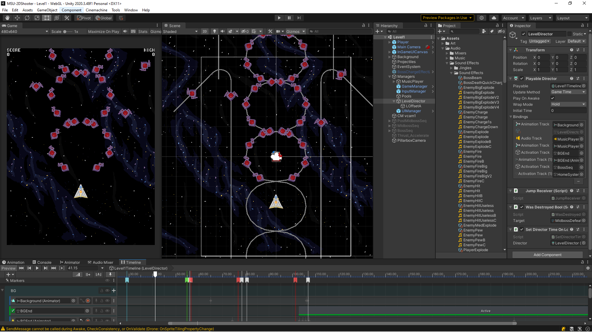
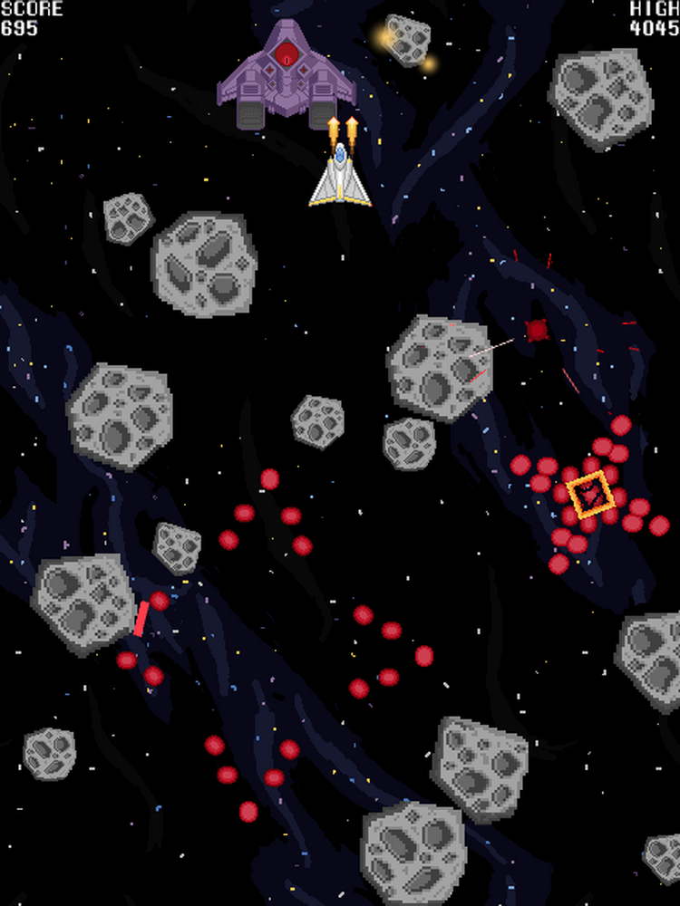
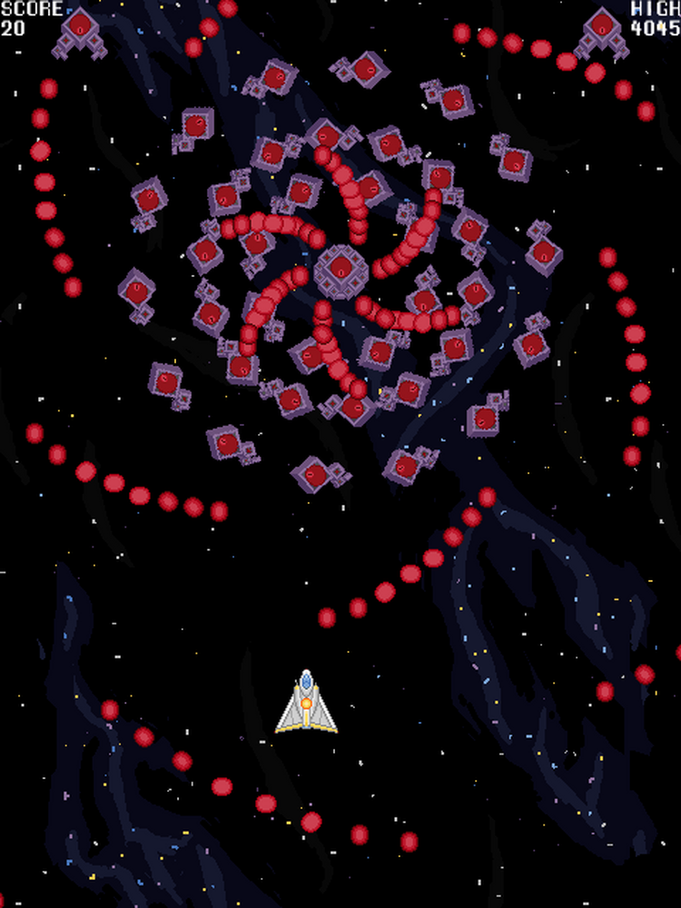

# [Star Gun](https://mvest.itch.io/msu-2d-shooter) (2023)
<figure style="max-width: 40%;padding: 20px; margin:0px; float:right" >

<figcaption style="text-wrap:pretty; font-size:11px; text-align:center;">The boss segment at the end of the level.  The player doesn't have room to look at the top of the screen, so the background's movement acts as a secondary visual indicator of time remaining.</figcaption>
</figure>
Star Gun is vertical slice of a top-scrolling arcade style danmaku game I made in Unity for an online course.  The finished game consists of a single level a few minutes long including a midboss and multi-phase end of level boss.  The enemy patterns are entirely controlled using Unity's Timeline module and spline code I wrote for it.  The choreography was also done with custom-made editor tools integrated into the timeline editor.  

#### Development
The early decision to limit the scope to a single level meant that I was able to spend a good deal of time adding variety and polishing micro-interactions in it.  I designed the pacing of the level around the background music.

This was a solo project made for an online game design course offered by <a href="https://gamedev.msu.edu/">MSU</a> where we were tasked with making a 2d shooter in Unity.  They provided basic starting assets for developing the game, which we were allowed to add to and replace as we wanted.  The base code and assets provided were insufficient for what I wanted to do, so I chose to make additional assets in the style of the provided assets. I ended up replacing most of the code.  All of the game logic and editor tool code is original. The sprites and sound effects are a mix of the basic assets I was given and assets that I made to match the style. The enemy variations, particle effects, and boss sprites & sfx are my own work.

<figure style="padding: 20px; margin:0px;" >

<figcaption style="text-wrap:pretty; font-size:11px; text-align:center;">Editor screenshot of the custom spline and timeline tool code I wrote to more easily choreograph the level.</figcaption>
</figure>

#### Strengths & Weaknesses
There is a good amount of variety in it for a single level, and I'm happy with the current feel of the gameplay. It's a bit mechanically simple, without any unique gimmicks to make it stand out, but I feel it's well done for what it is.

Looking back, the biggest issue with it is that it's overtuned.  Pacing-wise, I would say it's too aggressive, both in the rate at which it introduces new enemy behavior and the rate that it ramps up in difficulty.  The high difficulty was for the most part intentional, as it was intended to evoke old arcade shmups which can be notoriously difficult (e.g. *Dodonpachi*, *Ikaruga*, *Mushihimesama*).  It's also something of a necessary compromise I had to make to be able to fit anything interesting into the short overall length of it.  Still, it's a bit much.  

A potential solution for the difficulty would be to add mechanics like bombs or shields that give the player more breathing room.  If it were to be made into a full game, I would also pace out and expand more on the ideas in it. For instance, a lot more could be done with the asteroid section, probably enough to be made into a full level. It would benefit from some more lulls in the action for contrast. Slower, calmer sections (maybe against static emplacements or something) where the player is more focused on score and clearing enemies rather than not dying. 

<figure style="padding: 20px; margin:0px;" >

  

  

<figcaption style="text-wrap:pretty; font-size:11px; text-align:center;">The mid-level asteroid field section and one of the more intricate bullet patterns.</figcaption>
</figure>

It has various other minor issues and missing bits of polish which I've listed below as "quibbles."  Small things like having no engine effects on the player ship and no visible lives counter.  Overall though, I'm happy with the current state of it and the many small issues like these that I was able to polish away.

#### Lessons learned
The biggest lesson this project really drove home was the importance of controlling scope.  Unlike other projects I've worked on, I went into this with the intent to make a vertical slice rather than a full game.  And the benefits of it really show in the end result.  It's the first project I've worked on that felt like designing a *game* rather than an engine.  A properly complete experience.  Most of the development time was spent on level design, asset creation, and polish rather than implementing underlying game systems and framework.

Release build:&emsp;*<a href="https://mvest.itch.io/msu-2d-shooter"> mvest.itch.io/msu-2d-shooter</a>* 
Source code:&emsp;*<a href="https://github.com/mvestrand/MSU-2DShooter">github.com/mvestrand/MSU-2DShooter</a>*

*Note: If the movement feels off in the browser based game (eating input, no diagonal movement, etc.), try using one of the downloadable versions instead.  There's a weird issue in some browsers which seems to limit the number of simultaneous held keys, causing frustrating issues. As far as I can tell, there is no way to resolve it other than digging into Unity's input system code.*

Areas for Improvement

<ul class="side-notes">
<li>The mines need a visible radius to indicate where is safe and convey that they are proximity activated (also potentially add a short, visible activation delay).</li>
<li>The player ship's feel would be better with an engine effect and a faint visible trail (both to convey movement and as a player fiddle). We were given an animation loop for it, but I'm unhappy with how visually noisy it is in an inherently noisy genre. It needs to be a more subtle effect, otherwise it's better without it.</li>
<li>Add visual roll to the player ship when pressing left or right. Not to effect gameplay at all, just to be an aesthetic touch and a potential player fiddle (maybe by spamming the left and right keys back and forth to build up spin).</li>
<li>Add a reason *not* to constantly hold down shoot, probably by having something that's more dangerous when destroyed. Some games do this by making holding the fire button (instead of slowly tapping it) act as the slow movement button</li>
<li>I *could* add back in the focusing of the firing pattern that happens with the shift key. Adding a brief interpolation between the two makes tapping focus work as another player fiddle. However, I think I prefer the current spread out pattern because it incentivizes the player to get closer to the enemy for more damage, adding a risk-reward aspect to it. *Some* kind of change could happen though, maybe only being partially more focused, or having small focused vs homing. At the very least, there should be some visual change when using it.</li>
<li>Adding some forms of collectibles for extra-points along with a way to suck up everything on screen at once, probably by crossing a line at the top of the screen. It needs care in the visual design of them to keep them from being visually distracting.</li>
<li>It's common to have some form of attack power-up. However, I feel it's hard enough as is without adding an extra punishment for dying. If I did add it, it would probably be as 1-4 little drones around the player (fixed formation with a slight eased delay while following the player's movement to make them feel a bit bouncy). Actually, they could probably also act simultaneously as an extra-hit as well as a boost to damage, so maybe it could make the game a bit easier.</li>
<li>It needs some way to know the number of lives remaining. Maybe at the top of the screen with a solid background along with bombs and weapon strength, or as a visual on the ship itself (maybe shields that break, maybe the ship becomes visibly damaged, maybe you have a little series of orbs that follow). I initially added simplistic icons of the ship to the hud, but removed it to reduce visual noise.</li>
<li>If possible, it would be good to fix the known issues of the in-browser version: the broken held inputs issue *(no idea how to resolve it)*, and the missing low-pass fade-in on the bgm *(just add a bgm version with the effect baked in).*</li>

</ul>

